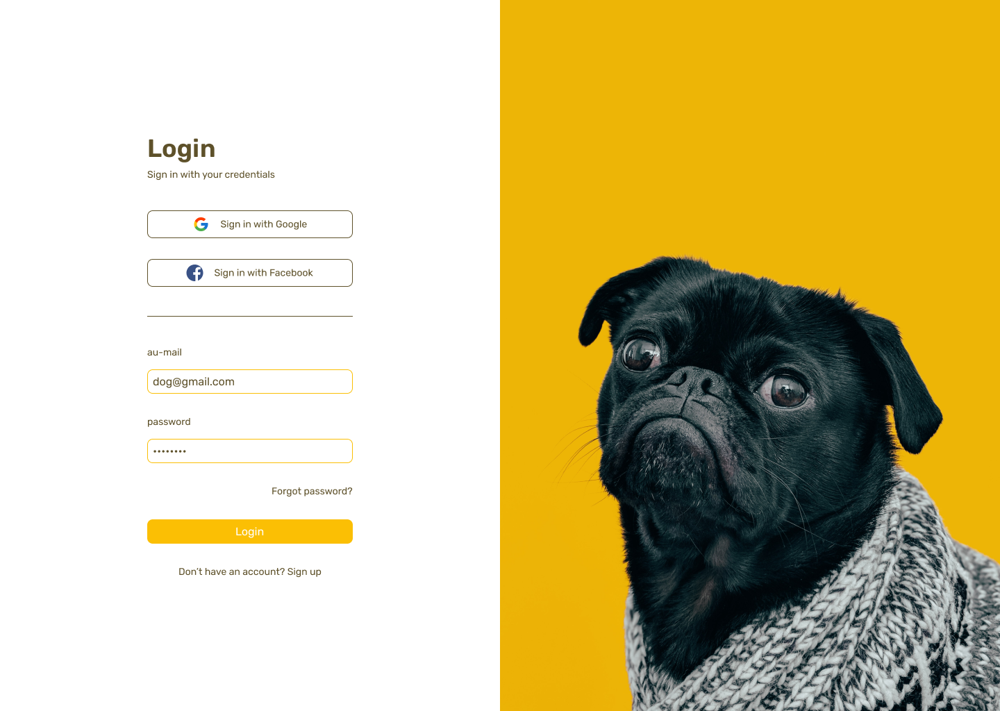

<h1 align="center">My-dog</h1>

<p align="center">Esse projeto é uma rede social para cães desenvolvido com Next.js e Firebase.</p>

---

<h1 align="center">
  
</h1>

<a href="https://my-dog.vercel.app">Ver o projeto no ar</a>

### Features
- [x] React Portals
- [x] Data Fetching
- [ ] Responsivo

### Pré-requisitos

Antes de começar, você vai precisar ter instalado em sua máquina as seguintes ferramentas:
[Git](https://git-scm.com), [Node.js](https://nodejs.org/en/).

Além disto é bom ter um editor para trabalhar com o código como [VSCode](https://code.visualstudio.com/)

### Rodando a aplicação

```bash
# Clone este repositório
$ git clone https://github.com/andersonszdc/My-dog
# Acesse a pasta do projeto no terminal/cmd
$ cd My-dog
# Faça uma cópia de '.env.example' para '.env.local'
# Coloque sua chaves secretas
$ copy .env.example .env.local
# repita o mesmo processo na pasta do frontend
# Instale as dependências
$ npm install
# Para iniciar o servidor, execute este comando
$ npm run dev
```
